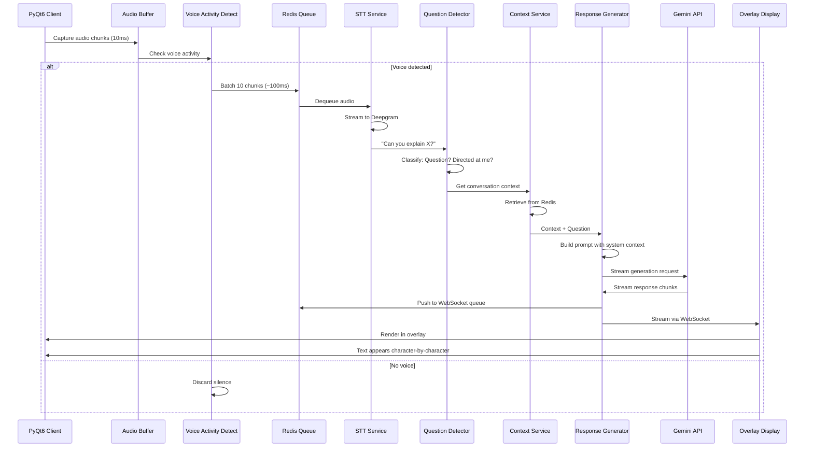
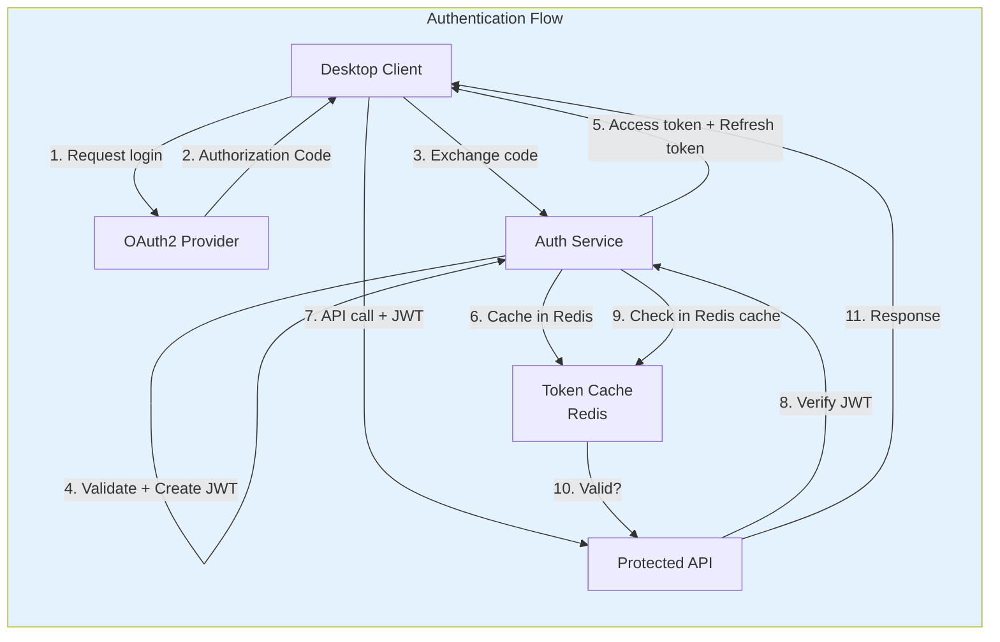
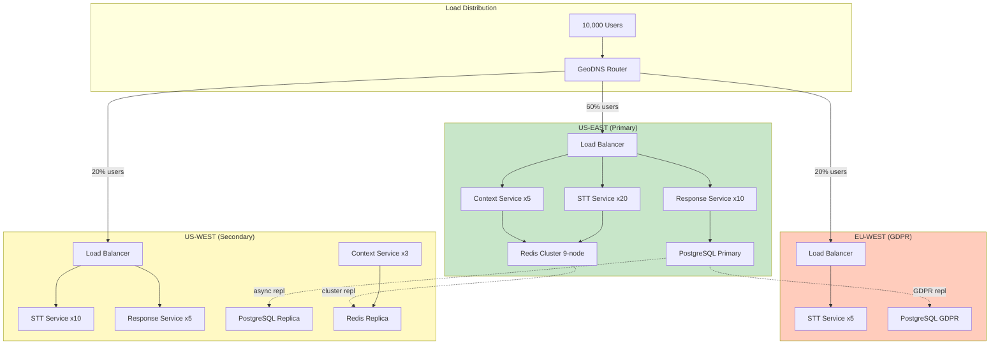
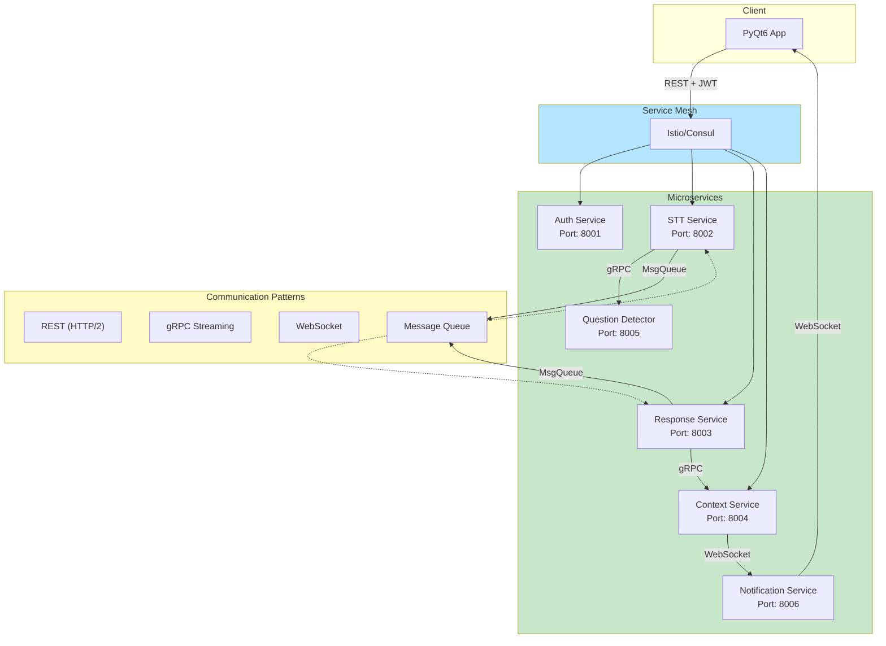
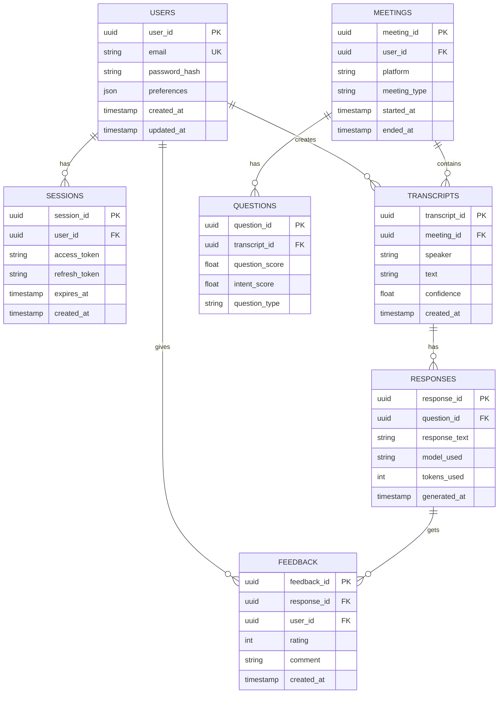
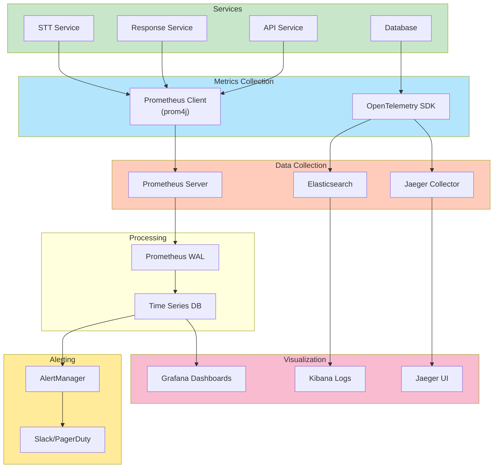
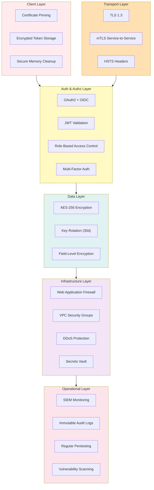
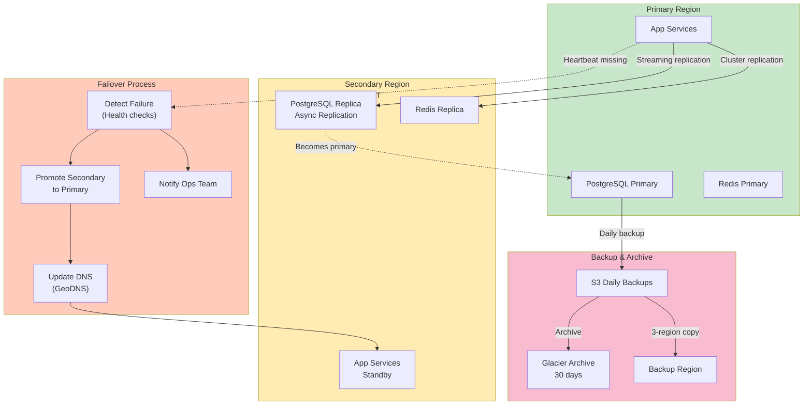
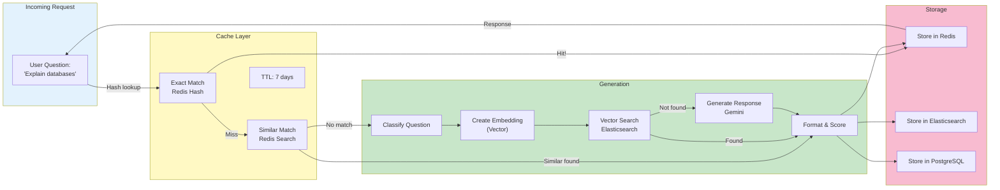

# System Architecture Diagrams

Complete visual representations of the AMETHYST production architecture.

---

## 1. High-Level System Architecture

```mermaid
graph TB
    subgraph client["CLIENT TIER"]
        pyqt["PyQt6 Desktop App"]
        overlay["Transparent Overlay UI"]
        audio["WASAPI Audio Capture"]
    end
    
    subgraph network["NETWORK LAYER"]
        lb["Load Balancer"]
        apigw["API Gateway"]
        mesh["Service Mesh"]
    end
    
    subgraph api["API SERVICES"]
        auth["Auth Service"]
        stt["STT Service"]
        resp["Response Service"]
        ctx["Context Service"]
    end
    
    subgraph queue["MESSAGE QUEUE"]
        redis_q["Redis Streams"]
        rmq["RabbitMQ"]
        kafka["Kafka"]
    end
    
    subgraph data["DATA TIER"]
        pg["PostgreSQL"]
        redis["Redis Cache"]
        es["Elasticsearch"]
        s3["S3 Storage"]
    end
    
    subgraph external["EXTERNAL APIs"]
        gemini["Gemini Flash API"]
        deepgram["Deepgram STT"]
    end
    
    subgraph observability["MONITORING"]
        prom["Prometheus"]
        graf["Grafana"]
        jaeger["Jaeger Tracing"]
    end
    
    client -->|mTLS + JWT| lb
    lb --> apigw
    apigw --> mesh
    
    mesh --> auth
    mesh --> stt
    mesh --> resp
    mesh --> ctx
    
    stt --> redis_q
    resp --> rmq
    auth --> redis
    ctx --> redis
    
    auth --> pg
    resp --> pg
    ctx --> redis
    
    stt --> deepgram
    resp --> gemini
    
    stt, resp, auth, ctx -.->|metrics| prom
    prom --> graf
    prom --> jaeger
    
    style client fill:#e1f5ff
    style api fill:#c8e6c9
    style data fill:#fff9c4
    style external fill:#f8bbd0
    style observability fill:#e0bee7
```

---

## 2. Data Flow - Audio to Response



---

## 3. Authentication & Authorization Flow



---

## 4. Scaling Architecture (10K Users)



---

## 5. Microservices Communication



---

## 6. CI/CD Pipeline

```mermaid
graph LR
    subgraph dev["Development"]
        code["Code Push"]
        branch["Git Branch"]
    end
    
    subgraph ci["CI Pipeline"]
        test["Unit Tests"]
        lint["Linting"]
        sast["SAST Scan"]
        build["Docker Build"]
        sec["Security Scan"]
    end
    
    subgraph deploy["Deployment"]
        ecr["Push to ECR"]
        staging["Deploy Staging"]
        e2e["E2E Tests"]
        aprove["Manual Approval"]
        prod["Deploy Production"]
    end
    
    subgraph monitor["Monitoring"]
        health["Health Check"]
        metrics["Metrics"]
        alert["Alerts"]
    end
    
    code --> branch
    branch -->|GitHub Actions| test
    test --> lint
    lint --> sast
    sast --> build
    build --> sec
    
    sec -->|Success| ecr
    ecr --> staging
    staging --> e2e
    e2e -->|Pass| aprove
    aprove -->|Manual| prod
    
    prod --> health
    health --> metrics
    metrics --> alert
    
    alert -->|Failure| code
    
    style dev fill:#e1f5ff
    style ci fill:#c8e6c9
    style deploy fill:#ffe0b2
    style monitor fill:#f8bbd0
```



---

## 7. Database Schema (Simplified)



---

## 8. Kubernetes Deployment Architecture

```mermaid
graph TB
    subgraph cluster["EKS Cluster"]
        subgraph ns["amethyst namespace"]
            subgraph svc["Services"]
                apigw_svc["API Gateway Service"]
                stt_svc["STT Service"]
                resp_svc["Response Service"]
                ctx_svc["Context Service"]
            end
            
            subgraph deploy["Deployments with HPA"]
                stt_dep["STT Deployment\n(10-50 replicas)"]
                resp_dep["Response Deployment\n(5-30 replicas)"]
                ctx_dep["Context Deployment\n(3-20 replicas)"]
            end
            
            subgraph stateful["Stateful Sets"]
                pg_sts["PostgreSQL Primary"]
                redis_sts["Redis Cluster"]
            end
            
            subgraph config["Config & Secrets"]
                cm["ConfigMap"]
                secret["Secret"]
            end
            
            subgraph network["Network Policies"]
                netpol["Deny external\nAllow ingress"]
            end
        end
        
        subgraph ingress_tier["Ingress Tier"]
            ingress["Ingress Controller\n(Nginx)"]
            cert["SSL/TLS Cert\n(Let's Encrypt)"]
        end
    end
    
    subgraph external_lb["AWS"]
        elb["Elastic Load Balancer"]
        waf["Web Application Firewall"]
    end
    
    elb --> waf
    waf --> ingress
    ingress --> cert
    ingress --> apigw_svc
    
    apigw_svc --> stt_svc
    apigw_svc --> resp_svc
    apigw_svc --> ctx_svc
    
    stt_svc --> stt_dep
    resp_svc --> resp_dep
    ctx_svc --> ctx_dep
    
    stt_dep --> redis_sts
    resp_dep --> pg_sts
    ctx_dep --> redis_sts
    
    stt_dep, resp_dep, ctx_dep --> cm
    stt_dep, resp_dep, ctx_dep --> secret
    
    deploy --> netpol
    
    style cluster fill:#e0f2f1
    style ingress_tier fill:#fff9c4
    style external_lb fill:#ffccbc
```

---

## 9. Monitoring Stack Architecture



---

## 10. Security Layers



---

## 11. Disaster Recovery



---

## 12. Response Caching Strategy



---

All diagrams are Mermaid syntax and can be viewed in:
- GitHub markdown preview
- Mermaid Live Editor (mermaid.live)
- VS Code with Mermaid extension

